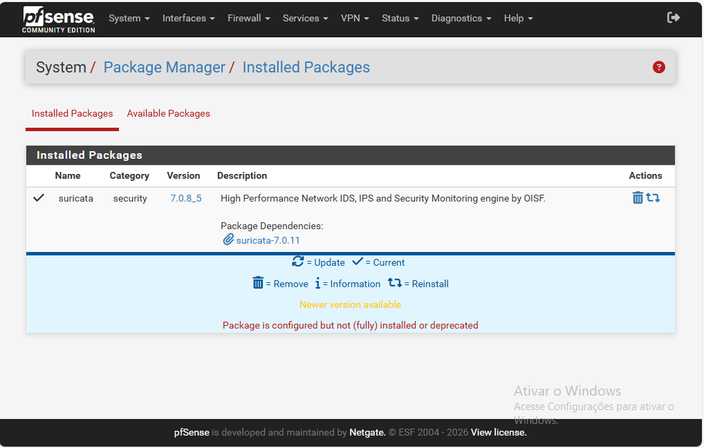
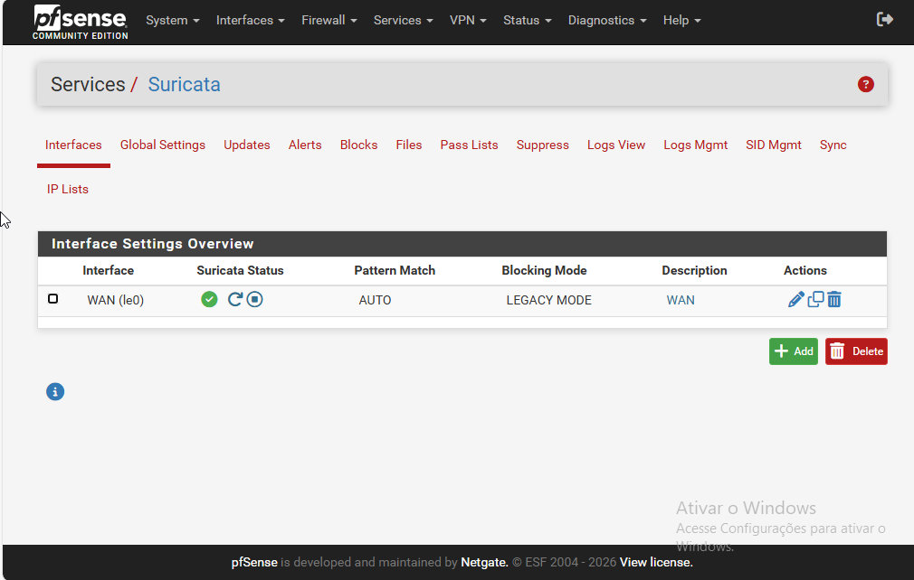

# 🛡️ Laboratório de Defesa Ativa: pfSense + Suricata (IDS/IPS)

### **1. Visão Geral**
Este repositório documenta a implementação de um sistema de detecção e prevenção de intrusão (IDS/IPS) utilizando o motor **Suricata v7.0.8** integrado ao firewall **pfSense**. O projeto demonstra a transição entre o monitoramento passivo de rede e a resposta automática a incidentes de segurança.

### **2. Implementação e Configuração**
O motor Suricata foi instalado e configurado para atuar na interface de borda (WAN), utilizando o conjunto de assinaturas *Emerging Threats (ET) Open* para identificação de padrões maliciosos.

> **Evidência de Instalação:**
> 
> *Figura 1: Gerenciador de pacotes confirmando a instalação estável do Suricata no ecossistema pfSense.*

### **3. Monitoramento e Consistência (Modo IDS)**
Para validar a precisão do sensor, foram realizadas múltiplas requisições ao host de teste `testmyids.com`. O sistema demonstrou consistência ao identificar e registrar cada tentativa de intrusão, gerando alertas com granularidade de portas e horários distintos (15:05:00, 15:07:55 e 15:28:28).

> **Logs de Detecção Sequenciais:**
> 
> *Figura 2: Registro de múltiplos eventos de segurança comprovando a estabilidade e sensibilidade do sensor.*

### **4. Prevenção Ativa e Banimento (Modo IPS)**
A etapa final consistiu na configuração do modo de prevenção ativa. Ao transicionar a interface para **LEGACY MODE** com as funções *Block Offenders* e *Kill States* habilitadas, o sistema passou a banir automaticamente o host agressor.

> **Configuração da Interface (IPS):**
> 
> *Figura 3: Interface WAN operando em modo de prevenção ativa (Legacy Mode).*

A eficácia da defesa foi confirmada através da tabela de banimento, onde o IP externo (`217.160.0.187`) foi impedido de realizar novas comunicações com a rede interna.

> **Confirmação de Bloqueio Automático:**
> 
> *Figura 4: Host agressor banido pelo firewall imediatamente após a detecção da ameaça.*

### **5. Conclusão Técnica**
O laboratório demonstrou com sucesso a eficácia de um sistema IPS na mitigação de ameaças conhecidas. O uso estratégico do **Kill States** foi fundamental para garantir que conexões maliciosas fossem interrompidas imediatamente, eliminando riscos de persistência e garantindo a resiliência da infraestrutura de rede.

#pfsense, #suricata, #ids-ips, #cybersecurity, #network-security, #blue-team, #firewall, #infosec
